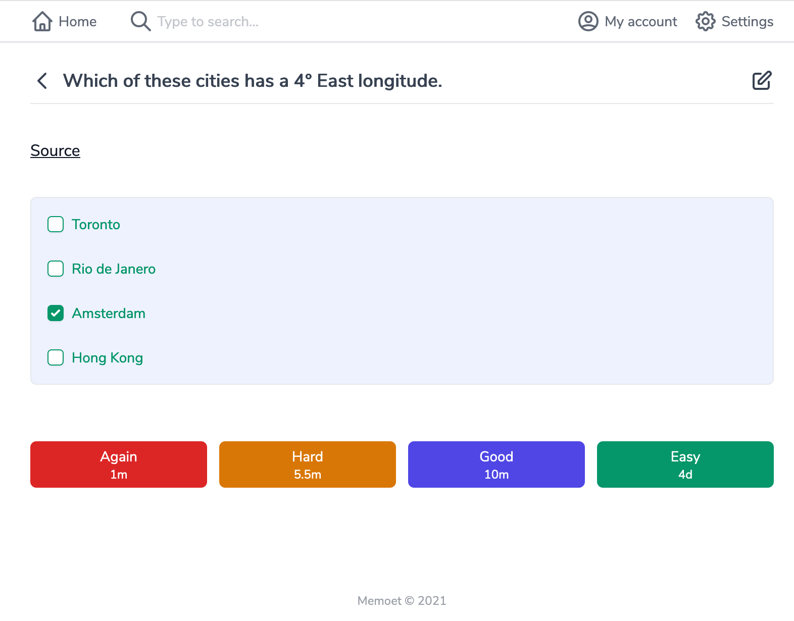

# Practice your notes

* Click **"Practice"** button on a deck to get started.
* After answering the quiz, rate your retrieval level from **Again** to **Easy** depend on your performance. The small text below each button shows the corresponding time to recall your note if you choose that option.

